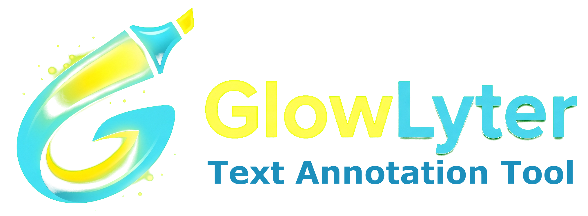
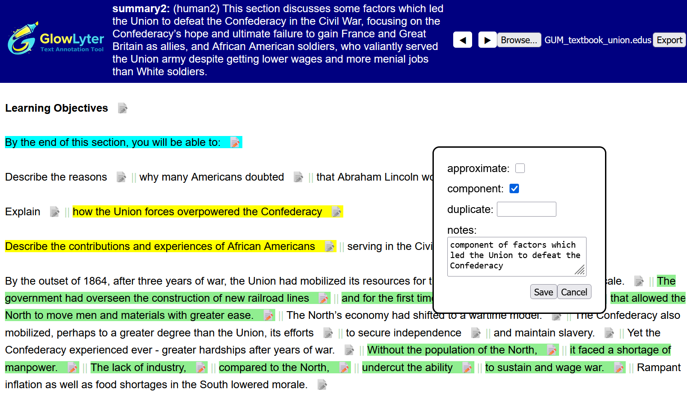

<div align="center"></div>

# GlowLyter

GlowLyter is a very simple, customizable tool for annotating spans of texts such as sentences or clauses in a running text. 

## Running

Just place the files from this repo in a folder and open glowlyter.html in your browser. Annotation is 100% client side:

  * upload a file to annotate by clicking "Browse..."
  * Export and save the file when you're done

## Demo

Download the file `example_annotated.txt`, then got to this URL and upload it to play with the interface:

https://gucorpling.org/glowlyter.html

## Use cases

The annotation tool was originally built for aligning text segments to content displayed in a carousel at the top of the interface, specifically aiming to highlight sentences that correspond to contents in multiple summaries of a document. However it can be used to highlight and categorize text spans in a running document in many ways.

## Interface

<div align="center"></div>

### Format

Documents have two parts: a header with lines prefixed by `#`, and running spans for highlighting, one per line. Here is an example of the format:

```ini
# summary1 = This excerpt from a history book tells about the American Civil War, describing economic...
# summary2 = (human2) This section discusses some factors which led the Union to defeat the ...
# annos = approximate:check;component:check;duplicate:0-128;quality:low,medium,high;notes
15.4 The Union Triumphant
The lack of industry,
compared to the North,
\s-2 undercut the ability
to sustain and wage war.
...
```

The carousel at the top will cycle through each metadata item in the header (except `annos`). In this example, there are two summaries - a separate highlighting profile will be stored for each one, so if you change from summary1 to summary2, highlights will behave separately. Annotations are save in the same format, but two additional columns are added for each metadata version: a binary column (highlighted or not) and a json column saving key-value annotations.

### Annos declaration

The `#annos` declaration is responsible for generating the annotation dialog elements when the "note" icon next to a unit is clicked. You can add various annotation types:

  * **Check boxes** - added using the syntax `annoname:check`
  * **Numerical fields** - added by specifying a range of numbers, for example: `duplicate:0-128` (to mark that a unit is a duplicate of one of the other units, with possible IDs between 0-128)
  * **Drop down lists** - added by specifying their values as in `annoname:val1,val2,val3,...`
  * **Free text** - declared as simple key names like `notes`

### Special span codes


The spans to be highlighted are given line by line below the header rows. In addition, special codes can trigger some behaviors:

  * For discontinuous spans we use the escape notation `\s-N`, where N is the content line that starts the discontinuous span. `\s-2` on the fourth content line means that this unit (unit 4) is part of the same unit as unit 2, and they should be highlighted together
  * `\b` indicates a unit to be displayed in bold (for headings)
  * `\i` indicates italics
  * `\l-NAME` is used for speaker labels 
  * `\n` adds a line of space at the end of paragraphs

## Citing

This interface was created for annotating proposition salience in this paper:

```bibtex
@inproceedings{ZeldesEtAl2026-propsal,
      title={Not Worth Mentioning? {A} Pilot Study on Salient Proposition Annotation}, 
      author={Amir Zeldes and Katherine Conhaim and Lauren Levine},
      year={2026},
      booktitle={Proceedings of the 20th Linguistic Annotation Workshop (LAW 2026)},
      address={San Diego, CA},
      url={https://arxiv.org/abs/2603.27358}, 
}
```